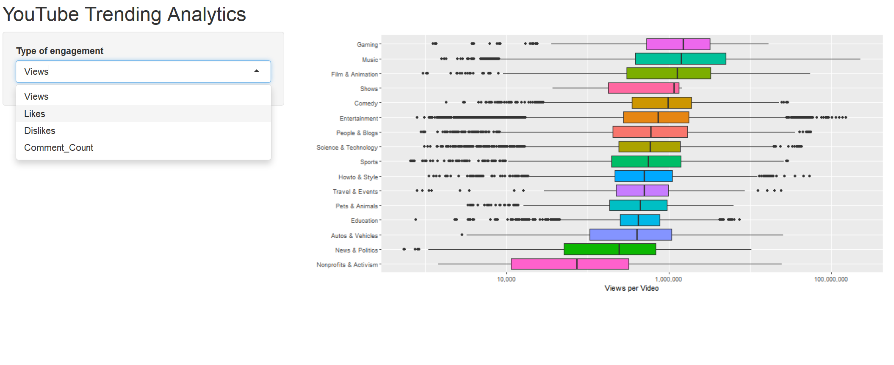
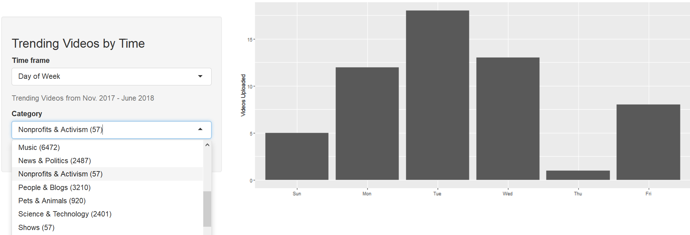
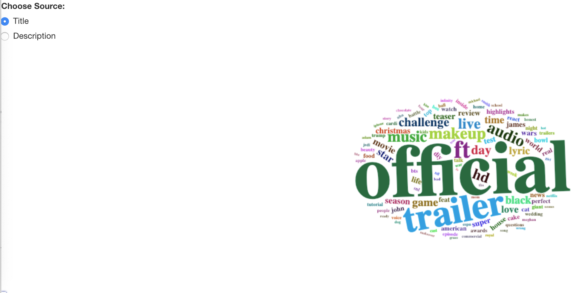
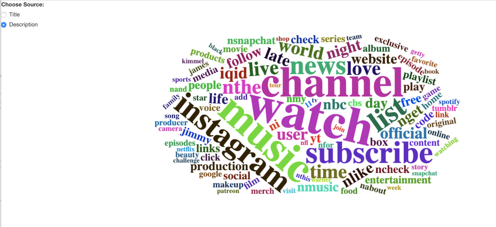

# YouTube Trending Analytics Usage and Functionality
#### Jim Pushor and Jack Yang
January 19, 2019

### Panel 1
#### Engagement
 

This panel allows the user to explore the level of engagement of trending videos across different categories on YouTube. The four options are: "Views", "Likes", "Dislikes" and "Comment Count". The graph is visualized as a boxplot in order to showcase the outliers and rough distribution of all these trending videos in their respective categories. Users can get a general feel for how much engagement is typically required to get a video on the frontpage of YouTube.

### Panel 2
#### Upload Times
 
The number of trending videos can be visualized by their upload times throughout the day. As we can see, popular content creators tend to upload videos in the late afternoon.

These trends can also be visualized by distinct categories. There are some variations across genre.

In addition of time of the day, users can observe trends through days of the week. Perhaps it is a little surprising, weekdays are a much busier time for popular content creators than the weekends.

This feature can also be toggled through the different categories.

### Panel 3
#### Trending Words using WordCloud2

It is overwhelming for a content creator to gain insight into how to construct title and description compositions while randomly scrolling through pages or raw data. We feel that wordclouds are an effective and engaging tool to provide this insight. Quite simply, the user chooses either Title or Description to produce a modest wordcloud. This image is also interactive in the sense that a user can hover over a word to see the frequency of it occurring. The words have been filtered to remove web addresses, 'non-words' and company names like: youtube.com, instagram.com, twitter.com. These expressions were not adding significant value for creative inspiration. We chose to perform backend cleaning by adding custom stop-words to assist with bringing the valuable words to the top. Future consideration is being given to utilizing regex expressions to help automate the task of filtering patterns of low-value words. Lastly, we will be implementing the ability to choose a specific category in future releases. We chose to keep it simple to assist with initial implementation and testing.

This is an example of the Title Wordcloud.

This is a screenshot of the Descriptive Wordcloud.
### Overall Considerations and Vision
 
Our vision for this project started out with considering a tool that could be used by a marketing professional or businesses wanting to boost their popularity. We realized that there are many tools available ('off the shelf') so we pivoted our focus to the individual who is needing insight to guide their creative strategy. Our goal is to produce a flexible app to do this. During these short iterations of this project, we have attempted to keep things simple in order to avoid getting lost in endless technical struggle but instead deliver an app that is functional and poignant. Our app will hopefully create small sparks of ideas from published and trending content with the goal of enlightenment and increased viewership.
Going forward, we will continue to test and "get a feel" for the app. We will improve the app's functionality by adding categorical and time filters. We will improve the aesthetic appeal by exploring themes. The wordcloud is slow to execute, so we will explore methods of improving this: i.e. Javascript versions. The bugs to address are around orientation of panels, execution time of wordcloud and
We would like to provide more narrative to the user to help with orientation. This could take the form of a summary or short tutorial.
